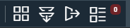
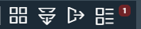
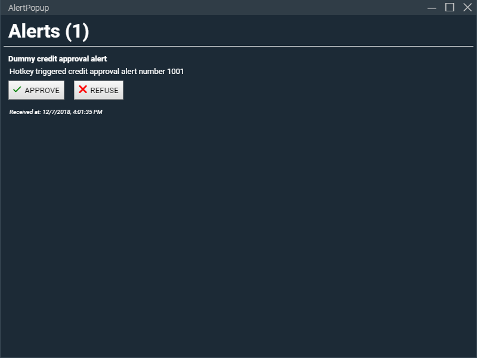

# Pop Up Alert Example

This example demonstrates common functionality needed in alerting service and components that will be used with remotely triggered events, for example via a websocket connection to an off-device service. The example doesn't include that connection but instead demonstrates the necessary UI functionality, simulating remotely triggered events with a hotkey (Ctrl + Shift + M).

This particular implementation is based on React for the components and makes use of Finsemble's [distributed store](https://documentation.chartiq.com/finsemble/tutorial-DistributedStore.html) to managage the state of the alert service (inlcuding the counts and contents of the alerts). However, it could also be implemented via Finsemble Router [listen/transmit](https://documentation.chartiq.com/finsemble/tutorial-TheRouter.html#first-supported-model-listen-transmit) and [query/responder](https://documentation.chartiq.com/finsemble/tutorial-TheRouter.html#second-supported-model-query-response) use if preferred.

## Files included

- Alert Manager service
    - _src/services/alertmanager/alertmanager.html_
    - _src/services/alertmanager/alertmanagerService.js_
- Alert Pop Up component
    - _src/components/AlertPopup/AlertPopup.css_
    - _src/components/AlertPopup/AlertPopup.html_
    - _src/components/AlertPopup/config.json_
    - _src/components/AlertPopup/finsemble.webpack.json_
    - _src/components/AlertPopup/src/app.jsx_
    - _src/components/AlertPopup/src/components/AlertComponent.jsx_
    - _src/components/AlertPopup/src/components/AlertPopupComponent.jsx_
    - _src/components/AlertPopup/src/components/OptionButton.jsx_
    - _src/components/AlertPopup/src/stores/AlertPopupStore.jsx_
- Alert Count toolbar button
    - src-built-in/components/toolbar/components/AlertCount.jsx

## Installation

**NOTE:** Installation instructions are based off of the [Finsemble Seed project](https://github.com/ChartIQ/finsemble-seed), some alteration may be necessary based on your project setup.

1. Install the Alert Manager service:
    1. Copy the contents of _src/services/alertmanager_ to the same folder in your project.
    2. Add the `alertmanagerService` configuration to _configs/application/services.json_:
        ``` JSON
            "alertmanagerService": {
                "useWindow": true,
                "active": true,
                "name": "alertmanagerService",
                "visible": false,
                "html": "$applicationRoot/services/alertmanager/alertmanager.html"
            }
        ```
2. Install the Alert Pop Up component:
    1. Copy the contents of _src/components/AlertPopup_ to the same folder in your project.
    2. Import the component configuration by adding it to _configs/openfin/manifest-local.json_:
        ``` JSON
        "finsemble": {
            "applicationRoot": "http://localhost:3375",
            "moduleRoot": "http://localhost:3375/finsemble",
            "servicesRoot": "http://localhost:3375/finsemble/services",
            "notificationURL": "http://localhost:3375/components/notification/notification.html",
            "importConfig": [
                "$applicationRoot/configs/application/config.json",
                "$applicationRoot/components/AlertPopup/config.json" // Added config
            ],
            "IAC": {
                "serverAddress" : "wss://127.0.0.1:3376"
            }
        }
        ```
        **NOTE:** The contents of _src/components/AlertPopup/config.json_ can also be added to _configs/application/components.json_ or to the application config after authentication [using dynamic configuration](https://documentation.chartiq.com/finsemble/ConfigClient.html#processAndSet).
3. Add Alert Count button to the toolbar
    1. Copy the contents of _src-built-in/components/toolbar_ to _src/components/toolbar_

        **Note:** It is recommended to copy built-in components from _src-built-in_ to _src_ before modifying and extending them.
    2. Copy _src-built-in/components/toolbar/components/AlertCount.jsx_ to _src/components/toolbar/components/AlertCount.jsx_ in your project
    3. Update _src/components/toolbar/src/dynamicToolbar.jsx_ to:
        - Import `AlertCount`:
            ``` JavaScript
            import AlertCount from "../components/AlertCount";
            ```
        - Add `AlertCount` to the list of custom components:
            ``` JavaScript
            customComponents["AlertCount"] = AlertCount;
            ```
    4. Add the Alert Count button to the toolbar
        - Add the following configuration to _src/components/toolbar/config.json_ (typically after the `BringToFront` component)
            ``` JSON
                {
                    "align": "right",
                    "type": "reactComponent",
                    "reactComponent": "AlertCount"
                },
            ```

            **NOTE:** This configuration can also be added to `finsemble.menus` after authentication [using dynamic configuration](https://documentation.chartiq.com/finsemble/ConfigClient.html#processAndSet).

4. The seed project can now be started using `npm run dev`

## Pop up alert tour
When Finsemble starts, you should see the Alert Button that was added to the toolbar at the far right of the toolbar. The zero in red indicates that no alerts have been received:



To simulate an alert being received, you can use the Ctrl + Shift + M hotkey for the service to generate an alert. You will see that that the Alert Button count now shows one notification:



The Alert Manager service will also open the AlertPopup component with the information about the alert:

 

## Generating alerts programmatically
Alerts can be generated programmatically using the following code:
``` JavaScript
const id = FSBL.Utils.guuid();
FSBL.Clients.RouterClient.query(
    "alertmanager",
    {
        query: "receiveAlert",
        alert: {
            id: id,
            title: "Dummy credit approval alert",
            msg: "Programmatically triggered credit approval alert number " + id,
            options: [
                "APPROVE",
                "REFUSE"
            ]
        }
    });
```
Note that the id field must be included and must be unique.

## Customizing behavior based on response
Each notification can be have different options, specified by the `alert.options` array. The action to take for each response given can be customized by changing the `respondToAlert` function in the Alert Manager service. By default, we're just logging the response we would send:
``` JavaScript
this.respondToAlert = function (alert, response, cb) {
    if (response){ 
        Logger.error("response to alert was undefined!"); 
        if (cb) { 
            cb("response to alert was undefined!", { alert: alert, status: "error" });
        }
    } else {
        // Dismiss the alert as we're about to respond to it
        this.dismissAlert(alert, function(err, res) {
            if(!err) { 
                res.status = "responded"; 

                //TODO: send the 'response' and any required info from the the 'alert' to the remote service
                console.debug("Responding to alert: ", res.alert.id, "response: ", response);
                Logger.debug("Responding to alert: ", res.alert.id, "response: ", response);
            } 

            if (cb) { 
                cb(err, res);
            }
        });
    }
}
```

## Customizing the Pop Up Alert example & connecting to a remote service ##
Please see the `//TODO:` comments included in the _/src/services/alertmanager/alertmanagerService.js_ file for details of how and where to add connections to / integration with a remote service. To summarize, you should: 
- setup any persistent connections in `alertmanagerService.setupConnections()`, replacing the hotkey setup (although you may wish to retrain a hotkey setup for displaying the AlertPopup component),
- add an code for sending responses to alerts in `alertmanagerService.respondToAlert()`.

Note that any changes to the alert data model are made in the service and represented in the distributed stored, with all other code picking up changes from the store and interacting with it functions on the service (exposed via the query responders setup on startup). Hence, only the microservice touches the connection to the remote service or changes the contents of the alerts store - which is considered best practice and keeps app architecture simple.
